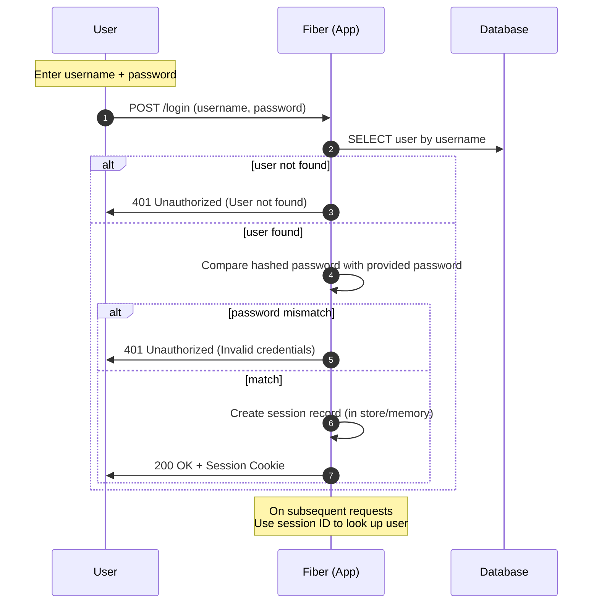
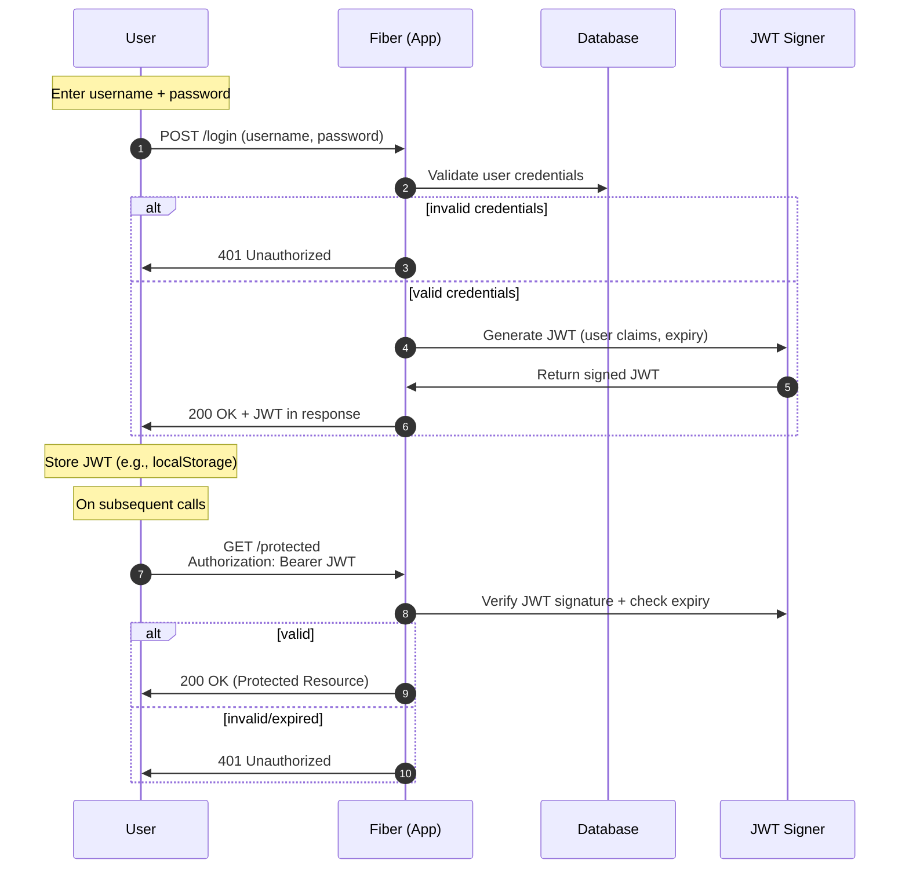
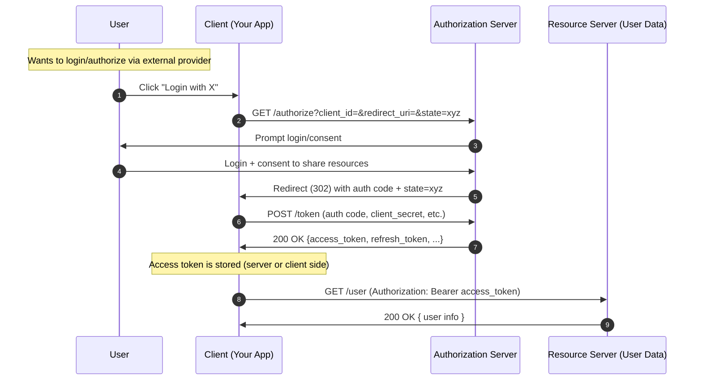
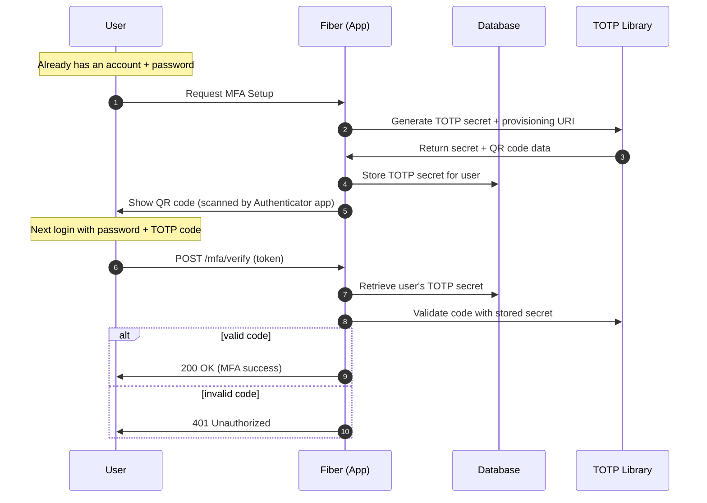
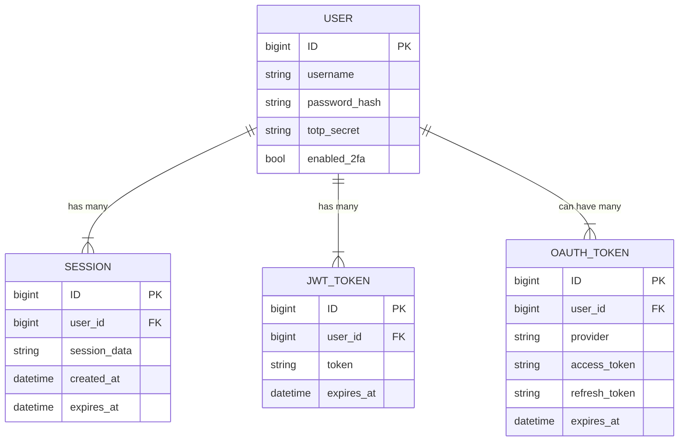
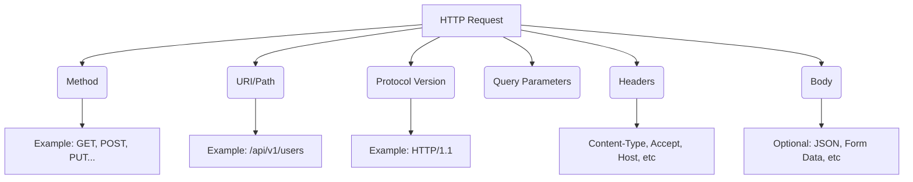
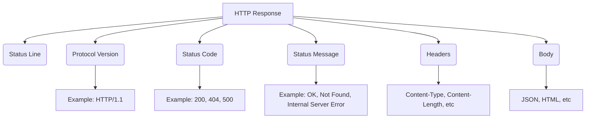
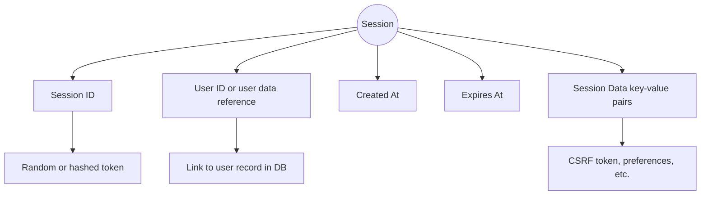
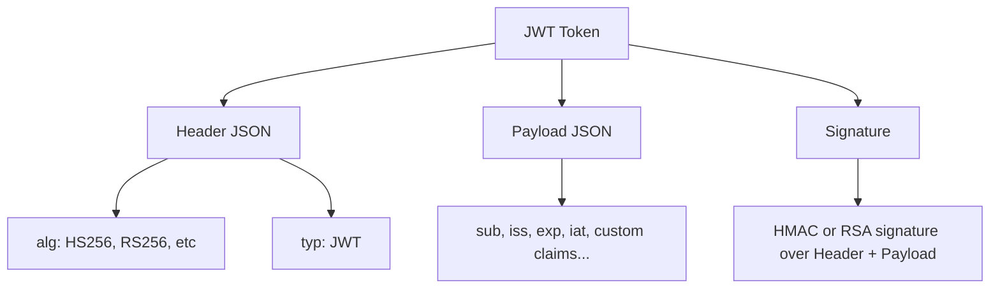
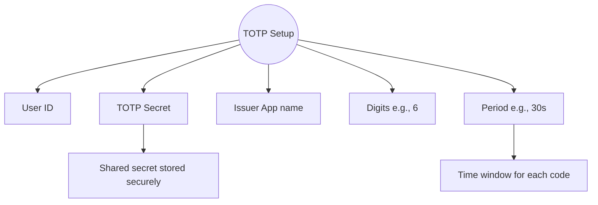

# Get serious with go web programming

----

Get solid at Backend Engineering

Launch hmr server

```bash
air
```

update swagger docs

```bash
swag init
```

## Notes

best way to add swagger for fiber:

- [fiber wrapper for swagger](https://github.com/gofiber/swagger)

follow this documentation: `swag init` and `swag`

- [the declarative comment formats](https://github.com/swaggo/swag#declarative-comments-format)

## notions


In this project, we will implement JWT


### basic authentication




### JWT




### Oauth2




### MFA/OTP




### ERD



## more notions


Look at these structures

### HTTP Request



### HTTP response



### Session



### JWT



### TOTP

